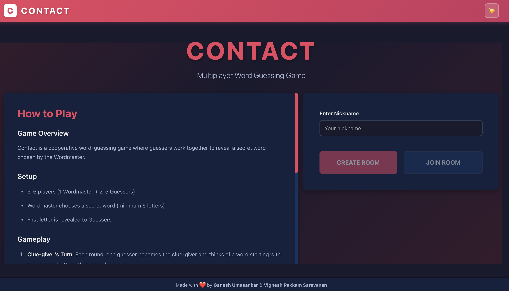
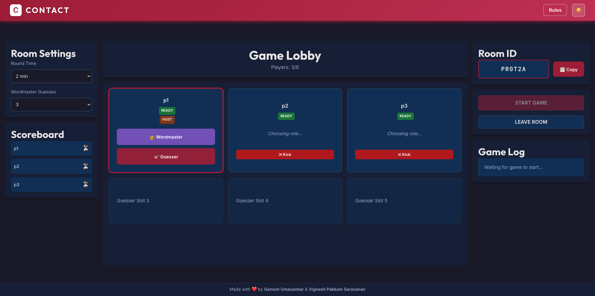
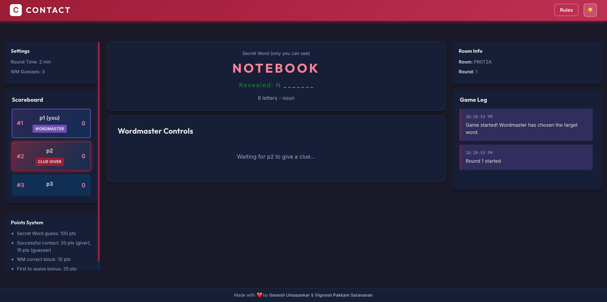
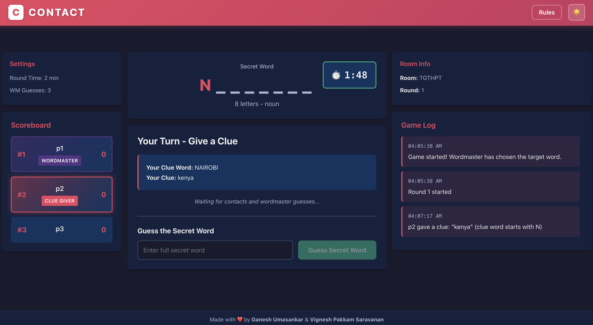
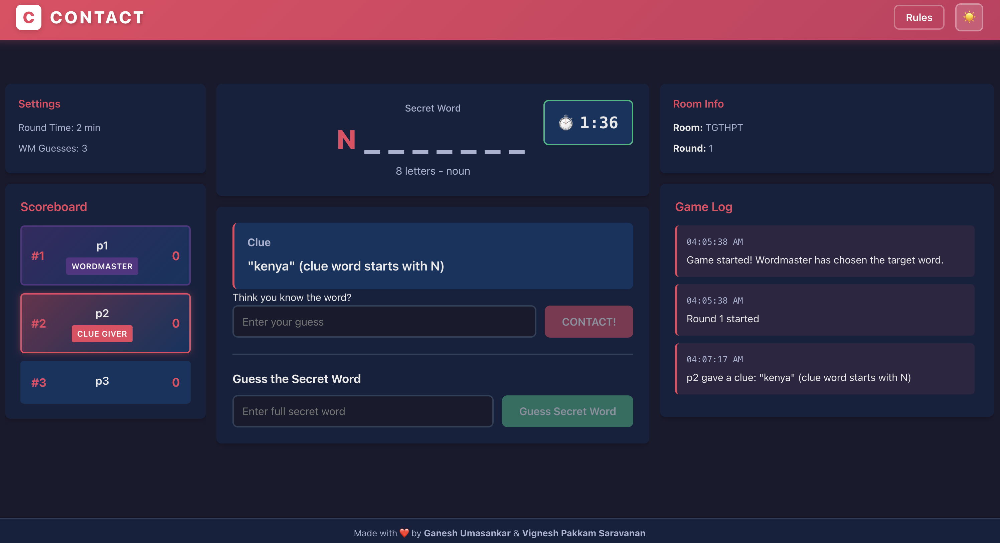
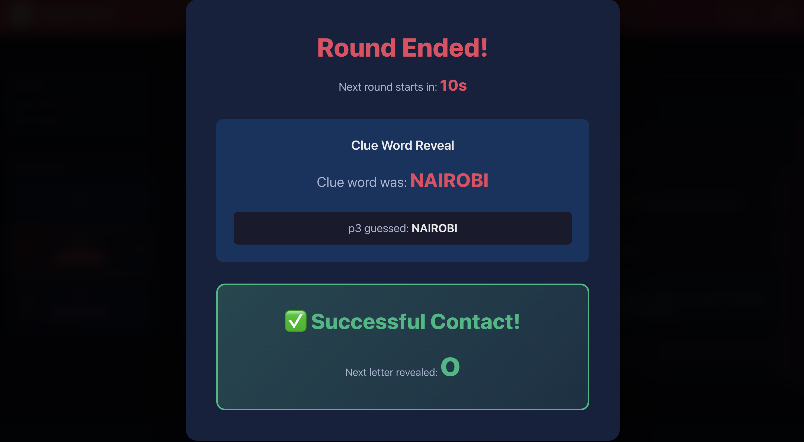
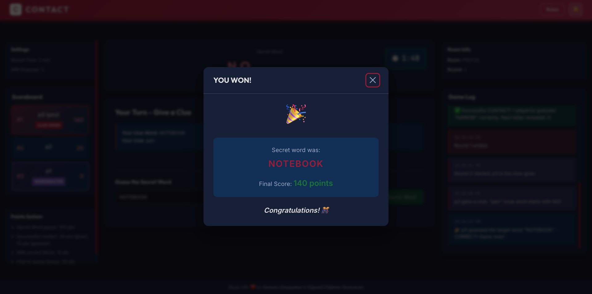
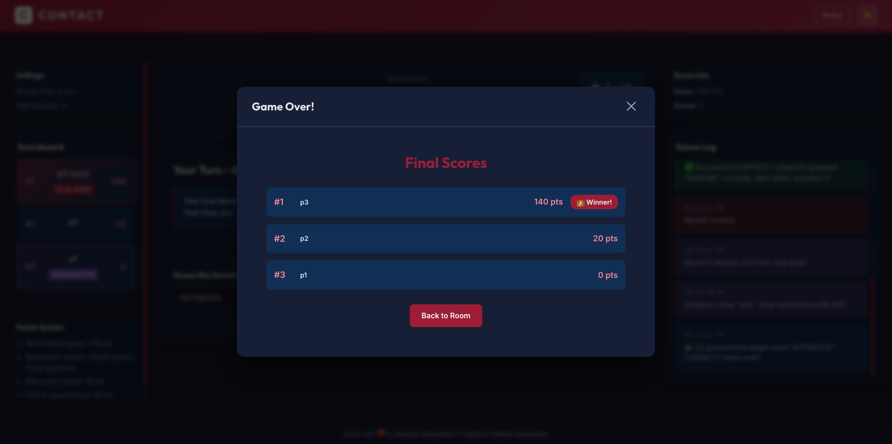

# Contact - Multiplayer Word Guessing Game

A real-time multiplayer word-guessing party game where players collaborate to reveal a secret word through strategic clue-giving and matching. Built as a full-stack web application with WebSocket integration for seamless real-time gameplay, session persistence, and responsive design for cross-device compatibility.

## Objective

This project demonstrates full-stack web development skills through a real-time multiplayer game application. It showcases WebSocket communication with Socket.io, React with Hooks for dynamic UI, MongoDB with native driver for data persistence, Express.js RESTful API development, and session management. The platform enables friends to play together remotely with features including room creation, role selection, live game state synchronization, and point tracking across multiple rounds.

## Authors

**Ganesh Umasankar**  
MS Computer Science Student  
Northeastern University, Boston, MA

Email: umasankar.g@northeastern.edu

**Vignesh Pakkam Saravanan**  
MS Computer Science Student  
Northeastern University, Boston, MA

Email: pakkamsaravanan.v@northeastern.edu

## Academic Reference

**Course:** CS5610 - Web Development  
**Institution:** Northeastern University  
**Semester:** Fall 2025  
**Course Website:** [https://johnguerra.co/classes/webDevelopment_fall_2025/](https://johnguerra.co/classes/webDevelopment_online_fall_2025/)

## Documentation & Resources

### Project Documentation

- **Design Document:** [Design Documentation](Contact_Design_Document.pdf)
- **Presentation:** [Project Slides](https://docs.google.com/presentation/d/170mWcAve1EyPw9lyy1Ht5iA-7zuXxjDkSRhpAnFne38/edit?usp=sharing)
- **Video Demo:** [Gameplay Walkthrough](https://drive.google.com/file/d/1uxQVgMDxbrQAiPvDDC551fEVgBVlUTwd/view?usp=sharing)
- **Live Website:** [https://contact-game.onrender.com](https://contact-game.onrender.com)
- **Source Code:** [GitHub Repository](https://github.com/Ganesh-U/contact-game)

## Screenshots

### Home Page


_Landing page with game rules and room creation/joining options_

### Room Lobby


_Pre-game lobby where players select roles (Wordmaster or Guesser)_

### Active Gameplay - Wordmaster View


_Wordmaster interface showing secret word and clue-blocking controls_

### Active Gameplay - Clue Giver View


_Clue-giver interface for submitting clues about words starting with revealed letters_

### Active Gameplay - Guesser View


_Guesser interface for making contact guesses and attempting the secret word_

### Round Transition


_Round end screen showing clue word reveal and contact results_

### Victory Screen


_Game completion screen celebrating the winner and revealing the secret word_

### Scoreboard


_Live scoreboard tracking points for all players throughout the game_

## Technology Requirements

### Core Technologies

- **Frontend:** React with Hooks, CSS
- **Backend:** Node.js with Express.js
- **Database:** MongoDB with native driver (no Mongoose)
- **Real-time:** Socket.io for WebSocket communication
- **Session Management:** express-session with connect-mongo
- **Routing:** React Router DOM

### Development Tools

- **ESLint:** JavaScript linting and code quality
- **Prettier:** Code formatting and consistency
- **Build Tool:** React Scripts 
- **Git:** Version control with clear commit history

### Browser Support

- Modern browsers supporting ES6+ and WebSocket
- Chrome 90+, Firefox 88+, Safari 14+, Edge 90+
- Mobile-responsive design for tablet and phone screens

## Installation & Usage

### Prerequisites

- Node.js v18 or higher
- MongoDB (local installation, Docker, or MongoDB Atlas)
- Git for version control
- Modern web browser with WebSocket support

### Local Development Setup

```bash
# Clone the repository
git clone https://github.com/YOUR_USERNAME/contact-game.git
cd contact-game

# Setup environment variables
# Create backend/.env with:
MONGODB_URI=mongodb://localhost:27017/contact
SESSION_SECRET=your-secret-key-here
PORT=5001
NODE_ENV=production

# Start MongoDB (if using Docker)
docker run -d -p 27017:27017 --name mongodb mongo:latest

# Seed the database with sample data (creates 1000+ synthetic records)
# (Optional, only needed once)
cd backend
npm run seed

# Return to project root and build
cd ..
npm run build
# This installs all dependencies (frontend + backend) and builds the React app

# Start the server (serves both frontend and backend on single port)
npm start

# Open browser and navigate to http://localhost:5001
# Everything runs on port 5001!
```

### Production Deployment (Single Service)

```bash
# From project root

# Install all dependencies and build frontend
npm run build

# Start production server
NODE_ENV=production npm start

# Application runs on http://localhost:5001
```

### Development Commands

```bash
# Backend (from backend/)
npm start              # Start backend server
npm run lint           # Run ESLint
npm run format         # Format with Prettier
npm run seed           # Seed database

# Frontend (from frontend/)
npm start              # Start development server
npm run build          # Build production bundle
npm run lint           # Run ESLint
npm run format         # Format with Prettier

# Root (deployment)
npm run build          # Build entire application
npm start              # Start production server
```

### Project Structure

```
contact-game/
├── backend/                      # Backend server
│   ├── config/
│   │   └── db.js                 # MongoDB connection
│   ├── models/
│   │   ├── Room.js               # Room CRUD operations
│   │   └── Game.js               # Game CRUD operations
│   ├── routes/
│   │   ├── rooms.js              # Room REST API
│   │   └── games.js              # Game REST API
│   ├── socket/
│   │   └── gameSocket.js         # Socket.io event handlers
│   ├── utils/
│   │   └── gameLogic.js          # Game mechanics utilities
│   ├── scripts/
│   │   └── seed.js               # Database seeding script
│   ├── server.js                 # Express server setup
│   ├── eslint.config.js          # ESLint configuration
│   ├── .prettierrc               # Prettier configuration
│   └── package.json              # Backend dependencies
├── frontend/                     # React frontend
│   ├── public/
│   │   ├── index.html            # HTML template
│   │   ├── manifest.json         # PWA manifest
│   │   └── favicon.ico           # Site icon
│   ├── src/
│   │   ├── components/
│   │   │   ├── HomePage/
│   │   │   │   ├── HomePage.js   # Landing page
│   │   │   │   └── HomePage.css
│   │   │   ├── RoomPage/
│   │   │   │   ├── RoomPage.js   # Pre-game lobby
│   │   │   │   ├── RoomPage.css
│   │   │   │   ├── PlayerSlot.js # Player slot component
│   │   │   │   └── PlayerSlot.css
│   │   │   ├── GamePage/
│   │   │   │   ├── GamePage.js   # Main gameplay
│   │   │   │   ├── GamePage.css
│   │   │   │   ├── Scoreboard.js # Score tracking
│   │   │   │   ├── GameLog.js    # Event log
│   │   │   │   └── Timer.js      # Round timer
│   │   │   ├── Header/
│   │   │   │   ├── Header.js     # Navigation header
│   │   │   │   └── Header.css
│   │   │   ├── Footer/
│   │   │   │   ├── Footer.js     # Page footer
│   │   │   │   └── Footer.css
│   │   │   └── shared/
│   │   │       ├── Button.js     # Reusable button
│   │   │       ├── Button.css
│   │   │       ├── Modal.js      # Modal overlay
│   │   │       └── Modal.css
│   │   ├── hooks/
│   │   │   └── useSocket.js      # Socket.io custom hook
│   │   ├── utils/
│   │   │   └── api.js            # REST API client
│   │   ├── App.js                # Main app component
│   │   ├── App.css               # Global app styles
│   │   ├── index.js              # React entry point
│   │   └── index.css             # Global CSS variables
│   ├── eslint.config.js          # ESLint configuration
│   ├── .prettierrc               # Prettier configuration
│   └── package.json              # Frontend dependencies
├── package.json                  # Root build scripts
├── .gitignore                    # Git ignore rules
└── README.md                     # This file
```

## Game Rules

### Overview

Contact is a cooperative word-guessing game where Guessers work together to reveal a secret word chosen by the Wordmaster through strategic clue-giving and matching.

### Setup

- **Players:** 3-6 players (1 Wordmaster + 2-5 Guessers)
- **Wordmaster:** Chooses a secret word (minimum 5 letters)
- **First Letter:** Revealed to all Guessers at game start

### Gameplay

1. **Clue Round:** Each round, one Guesser becomes the clue-giver.
2. **Give Clue:** Clue-giver thinks of a word starting with revealed letters and provides a hint.
3. **Make Contact:** Other Guessers who think they know the clue word enter their guess and click "CONTACT!".
4. **Wordmaster Blocks:** Wordmaster has limited time and guesses to identify the clue word.
5. **Contact Success:** If Wordmaster fails to block and all Guessers (who clicked 'Contact') matches the clue word, the next letter is revealed.
6. **Secret Word Guess:** After each letter reveal, Guessers can attempt the full secret word (once per letter reveal).
7. **Victory:** The game ends when the secret word is guessed correctly or revealed completely, and the player with the most points wins the game.

### Scoring System

- **Correct Secret Word:** Base points (decreases per letter revealed)
- **Successful Contact:** Points awarded to clue-giver and matching Guessers
- **Wordmaster Block:** Points to Wordmaster for correct clue word guess
- **First to Guess Bonus:** Extra points for winning player

## Use of Generative AI

**This project contains a mix of original work and AI-assisted development.**

### AI Tools Used

- **Claude:** Sonnet 4.5 by Anthropic

### Specific AI Assistance

1. **Code Architecture:** Guidance on React component structure and Socket.io integration patterns
2. **Debugging Support:** Assistance with WebSocket event handling, session persistence, and state synchronization issues
3. **Deployment Configuration:** Help setting up single web service deployment with static file serving

### Example Prompts Used

- "How do I structure a React app with Socket.io for real-time multiplayer game state synchronization?"
- "Debug this Socket.io disconnect handling - players aren't being removed properly from active games"
- "How can I persist player sessions across page reloads using express-session and React state?"

### Original Work

- Complete game design and mechanics implementation
- User interface design and user experience flow
- Database schema design with Rooms and Games collections
- All Socket.io event handlers and game state management
- React component architecture and hooks implementation
- Full CRUD operations across multiple collections

## Features Implemented

### Core Functionality

- Real-time multiplayer gameplay with Socket.io
- Room creation and joining with unique codes
- Role selection (Wordmaster/Guesser) with validation
- Round-based gameplay with rotating clue-givers
- Contact matching system with simultaneous guess handling
- Live scoreboard with point tracking
- Game event log showing all actions
- Victory detection and game completion
- Session persistence across page reloads
- Player disconnect handling with 5-second grace period

## Future Enhancements

- Custom word lists and themed categories
- In-game chat for players
- Sound effects and background music

## License

This project is licensed under the MIT License - see the [LICENSE](LICENSE) file for details.

---

**Built with ❤️ by Ganesh Umasankar & Vignesh Pakkam Saravanan for CS 5610 Web Development**
